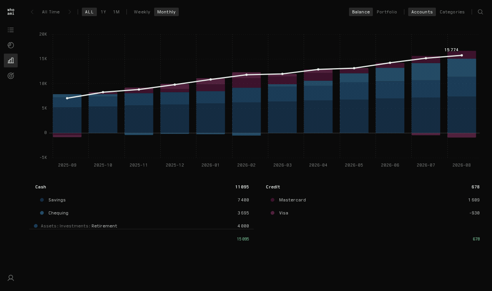
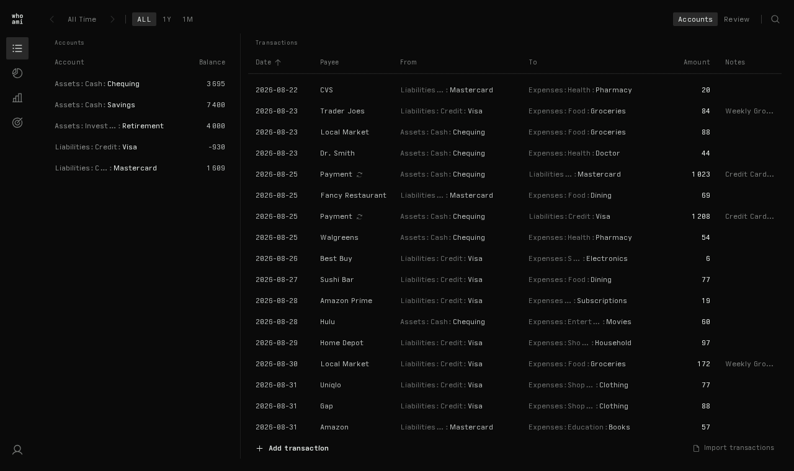

  

<h1 align="center">whoami.money</h1>

  <strong>Your money, in a file you own.</strong> 
  A personal finance tracker that runs entirely in your browser.

  <a href="https://whoami.money"><strong>Open the app</strong></a>
  &nbsp;·&nbsp;
  <a href="https://github.com/lazydancer/whoami-money/issues/new/choose">Report a problem</a>
  &nbsp;·&nbsp;
  <a href="SECURITY.md">Security</a>

---

Your ledger is a plain CSV on your device. Nothing leaves it unless you turn
sync on, and even then the server only ever sees ciphertext. This repository
is where problems and ideas are reported; the app's source is kept private,
and the issues are public so you can see what has been reported and fixed.

## What it does

### A ledger, not an app with a database

Every transaction is one line moving money from one account to another, the
way a bookkeeper would write it, in a grid you can click, drag, fill down and
paste into. Categories are account paths — `Expenses:Food:Groceries` — so
sorting and hierarchy are the same act, and the whole thing round-trips through
a CSV you can open in any spreadsheet.

  

### Bank statements in, categorised

Drop a CSV, OFX or QFX from your bank, or paste rows from a spreadsheet. The
app works out which account the statement belongs to, matches the rows you
already have, files each payee the way you filed it last time, and leaves what
is left for you to review.

### Reports that read a period

| Page          | What it answers                                                             |
| ------------- | --------------------------------------------------------------------------- |
| **Balance**   | What you own and owe, month by month, with the net line on top              |
| **Overview**  | Income against spending, and the saving rate on its own axis                |
| **Budget**    | Envelopes, with a class for the one-offs that break every budget            |
| **Portfolio** | What your investments actually returned, from the revaluations you recorded |
| **Future**    | A forecast that borrows the rate your own ledger measured                   |

### A review panel, not a nag

Duplicates, unusual amounts, lapsed bills, payees spelled two ways and rows
filed oddly are listed beside the ledger, each with its fix. A judgement call
you disagree with can be set aside for good.

### Private sync, if you want it

Turn on an account and your journal is encrypted on your device with a key
only you hold, then synced to a server that stores ciphertext and nothing it
could read. There is no password to reset, because there is no password. Share
a journal with a partner by code.

### An assistant that stays home

Categorisation help and review judgement can run against a model on your own
machine. Nothing about your finances goes to a hosted model unless you choose
one.

## Report a problem

> **Never paste financial data.** No journal CSV, no bank statement, no account
> key, no share code, no screenshot with real numbers in it. Almost anything
> can be reproduced with the app's built-in sample journal ("Look around first"
> on the start screen) or with a few invented rows.

Have three things ready: the app version (Journal → Guide, at the bottom),
your browser and its version, and the exact steps you took. Check the
[open issues](https://github.com/lazydancer/whoami-money/issues) first and add
to an existing one rather than opening a twin. Then pick a form:

| Form                                                                                                 | Use it when                                                                        |
| ---------------------------------------------------------------------------------------------------- | ---------------------------------------------------------------------------------- |
| [**Bug**](https://github.com/lazydancer/whoami-money/issues/new?template=bug.yml)                    | The app did something it should not have                                           |
| [**Import problem**](https://github.com/lazydancer/whoami-money/issues/new?template=import.yml)      | A bank file or paste was read wrongly or refused — describe its shape, never attach it |
| [**Idea**](https://github.com/lazydancer/whoami-money/issues/new?template=idea.yml)                  | Something the app does not do; the situation you were in is more useful than the feature |

Security problems go by email, not here — see [SECURITY.md](SECURITY.md).

## What happens next

Reports are read by one person, in order. A confirmed bug gets the `bug` label
and a note when the fix ships; an idea gets an honest reply about whether it
fits. The measure for every change is the same: a personal ledger is yours, it
stays on your device, and the app must earn any exception.
