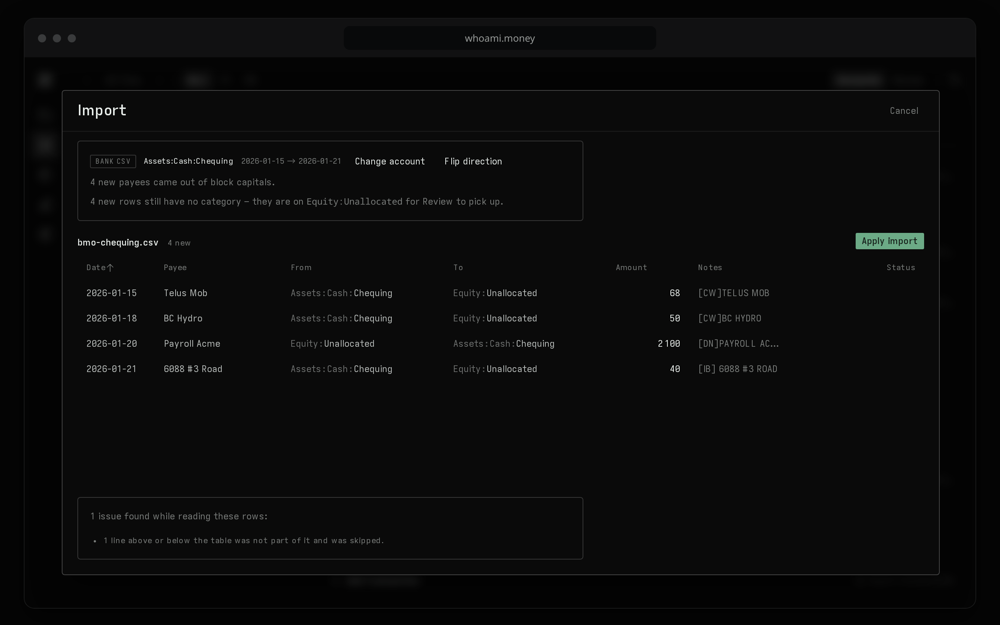
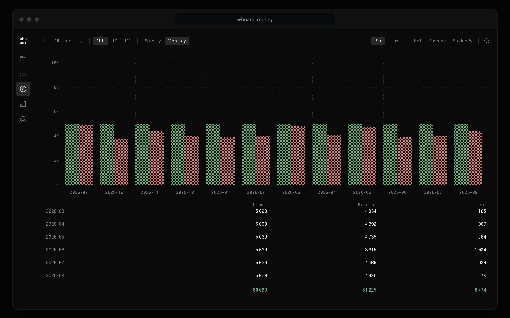

  

<h1 align="center">whoami.money</h1>

  <strong>private personal plain-text finance app</strong> 
  Budget and track your money in one CSV file you own. 
  No bank login. No account required. Encrypted sync if you want it.

  <a href="https://whoami.money"><strong>Open the app</strong></a>
  &nbsp;·&nbsp;
  <a href="https://github.com/lazydancer/whoami-money/issues/new/choose">Report a problem</a>
  &nbsp;·&nbsp;
  <a href="SECURITY.md">Security</a>

---

Your ledger is a plain CSV on your device. Nothing leaves it unless you turn
sync on, and even then the server only ever sees ciphertext. It never connects
to your bank.

This repository is where you report problems and ideas. The app's source is
private; the issues are public.

## What it does

**A ledger.** Every transaction is one line moving money from one account to
another. You type it in a grid: click a cell, drag a range, fill down, paste.
Categories are account paths — `Expenses:Food:Groceries` — and the whole thing
round-trips through a CSV you can open in any spreadsheet.

  

**Import.** Open a CSV you already have, import a bank or card statement (CSV,
OFX or QFX), paste rows from a spreadsheet, or type them. The importer reads
the file's own columns whatever shape they are in, works out which account the
statement belongs to, skips rows you already have, and categorises from your
own past filings.

  

**Reports.** Overview (income against spending), Balance (what you own and
owe, month by month), Budget (envelopes), Portfolio (what your investments
returned) and Future (a forecast from your own ledger). Every table is the same
grid as the ledger; click a bar or an account name and the page filters to it.

  

**Review.** A panel beside the ledger flags what looks off: a row entered
twice, a row uncategorised, an amount unlike every other one from that payee, a
bill that has stopped arriving. Click a finding and you land on the rows.

**Sync, if you want it.** For the same journal on your phone and laptop, or
shared with someone you live with. The app generates a random 256-bit key on
your device and shows it once. Everything is encrypted with it before it leaves
the browser, so the server stores ciphertext and nothing it can read. There is
no password and nothing to reset: lose the key and the server copy is
unreadable to everyone, you included. Your journal stays intact in every
browser that has it, and the CSV export needs no key.

## Cost and platform

The app is free, with nothing to sign up for. Sync is the part with a server
behind it, so sync is what may cost money; the app is complete without it.

It runs in any modern browser. Install it as a web app and it works offline on
macOS, Windows, Linux, Android and iOS.

## Who made it

One person, [@lazydancer](https://github.com/lazydancer). I write it and run
the sync server. The source is private, so the check that does not depend on
trusting me is your browser's network log.

## Report a problem

> **Never paste financial data.** No journal CSV, no bank statement, no account
> key, no share code, no screenshot with real numbers. Use the built-in sample
> journal or a few invented rows.

Include the app version, your browser, and the exact steps. Check the
[open issues](https://github.com/lazydancer/whoami-money/issues) first, then
pick a form:
[**Bug**](https://github.com/lazydancer/whoami-money/issues/new?template=bug.yml),
[**Import problem**](https://github.com/lazydancer/whoami-money/issues/new?template=import.yml)
(describe the file's shape, never attach it), or
[**Idea**](https://github.com/lazydancer/whoami-money/issues/new?template=idea.yml).

Security problems go by email — see [SECURITY.md](SECURITY.md).
